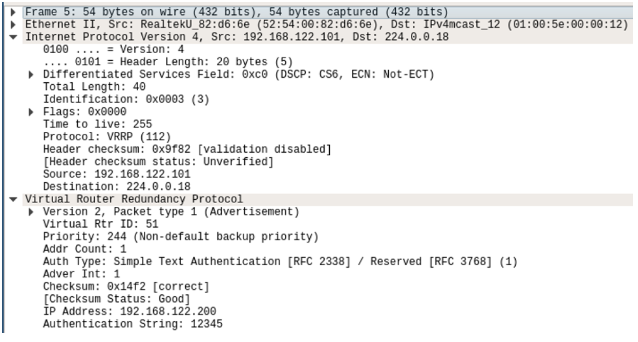

# Principes fondamentaux de Keepalived

Le protocole qui sous-tend le basculement HA est le protocole VRRP (Virtual Router Redundancy Protocol), et Keepalived fournit à la fois une version 2 et une version 3 de ce protocole.
 
Cela peut sembler étrange que nous utilisions un protocole conçu pour les routeurs sur nos serveurs. Il s'avère que la même technologie de mise en réseau utilisée pour assurer la redondance des équipements réseau peut également fournir une redondance dans les environnements de serveur. Les routeurs sont souvent déployés par paires, où un routeur est actif et un autre en veille, prêt à fonctionner en cas de défaillance du routeur actif. Ces mêmes concepts peuvent être appliqués aux serveurs.
 
**VRRP** utilise le concept d'une adresse IP virtuelle (VIP). Un ou plusieurs hôtes (routeurs, serveurs, etc.) participent à une élection pour déterminer l'hôte qui contrôlera ce VIP. Un seul hôte (le maître) contrôle le VIP à la fois. Si le maître tombe en panne, VRRP fournit des mécanismes pour détecter cette panne et basculer rapidement vers un hôte de secours. Dans la topologie ci-dessus, server1 est le maître et est responsable de l'adresse IP **192.168.56.7**. Si le serveur1 tombe en panne, le serveur2 prend le relais de cette IP.
 
Il convient également de savoir que **Keepalived** fournit plus qu'une simple implémentation VRRP. **Keepalived** a également la possibilité de configurer des serveurs virtuels IP Linux pour l'équilibrage de charge.

## Fonctionnement du protocole VRRP

Le comportement de VRRP est spécifié par RFC 3768 (version 2) et RFC 5798 (version 3).
 
La première étape des opérations de VRRP est l'élection d'un maître pour déterminer quel serveur (ou routeur, dans la spécification du protocole) détiendra l'adresse IP partagée. Les serveurs VRRP sont configurés avec une valeur de priorité, qui peut être considérée comme un poids. Le serveur avec la priorité la plus élevée sera le propriétaire d'une adresse VRRP. La spécification indique que la priorité du maître doit être 255, tout serveur backup ayant une valeur inférieure à 255. En pratique, une priorité de 255 n'est pas strictement nécessaire car le protocole sélectionnera le serveur avec la priorité la plus élevée, même s'il n'est pas 255.
 
Une fois qu'un maître est établi, tous les autres serveurs écoutent les messages périodiques envoyés par le maître pour indiquer qu'il est toujours actif. Le maître envoie ces annonces à intervalles réguliers. Tant que le maître est en vie, il desservira le trafic pour le VIP et enverra des notifications. Si le maître se déconnecte pour une raison quelconque, le serveur backup avec la priorité la plus élevée prendra le relais. De même, une fonctionnalité appelée **préemption** peut permettre à tout serveur ayant une priorité plus élevée de devenir automatiquement maître lorsqu'il est en ligne.
 
Lorsqu'un maître se connecte pour la première fois et prend le contrôle d'une adresse IP, il diffuse un ARP gratuit. Ce message informe les autres serveurs du réseau de l'adresse MAC associée au VIP afin qu'ils puissent adresser correctement leur trafic au niveau de la couche 2. Il accélère également le basculement du VIP : les hôtes n'ont pas à attendre que leurs temporisateurs ARP expirent et peuvent mettre simplement à jour leurs tables ARP avec l'adresse MAC correcte pour l'hôte qui possède le VIP.

## Format de paquet

Si nous jetons un coup d'œil à la structure des paquets d'une annonce VRRP à l'aide de Wireshark, nous remarquerons que les adresses de destination Ethernet et IP sont des adresses de multidiffusion. Le trafic de multidiffusion, est envoyé à plusieurs hôtes sur un réseau qui "écoutent" cette adresse de multidiffusion. La plupart des réseaux évitent une configuration multidiffusion complexe, de sorte que le trafic multidiffusion pour VRRP deviendra un trafic de diffusion sur le segment de réseau local et ira à tous les hôtes.
 
Nous pouvons également voir que VRRP n'est ni TCP ni UDP. VRRP utilise le numéro de protocole **IP 112** pour son fonctionnement. Connaître ce numéro de protocole peut être important, car nous devrions peut-être configurer votre pare-feu hôte pour autoriser ce trafic à partir des serveurs VRRP de notre environnement.
 

Une fois que nous regardons la section VRRP du paquet, nous remarquerons qu'elle contient toutes les informations nécessaires pour élire un maître et informer les autres serveurs du maître actuel :

- L'ID de routeur virtuel (VRID) est un identifiant unique pour une instance VRRP et ses adresses IP (il peut y en avoir plusieurs) sur un réseau. Nous devons éviter de réutiliser des VRID sur le même réseau local, mais ils peuvent être réutilisés en toute sécurité sur différents réseaux de couche 2.

- La priorité est la priorité de l'hôte qui envoie la notification. Le strict respect de la spécification doit utiliser 255 pour la priorité du maître, mais de nombreuses configurations choisissent une valeur différente.

- Le type d'authentification et la chaîne d'authentification contiennent un mot de passe texte simple pour authentifier les membres du groupe VRRP les uns avec les autres.

- L'intervalle de notification indique la fréquence à laquelle les notifications seront envoyées par le maître. Dans ce cas, le maître enverra une annonce toutes les secondes.

- L'adresse IP contient une ou plusieurs adresses IP dont le maître est responsable. Il est possible que VRRP gère plusieurs adresses IP.

 

Source : [https://www.redhat.com/sysadmin/ha-cluster-linux](https://www.redhat.com/sysadmin/ha-cluster-linux)